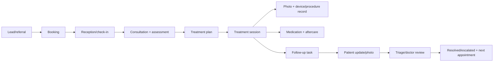

# Clinic workflow và state machine

## Quy tắc vận hành V1
- Appointment có arrival state; không dùng appointment thay cho clinical visit.
- EpisodeOfCare gom một concern/plan kéo dài; session là một lần thực hiện.
- Session “complete” chỉ khi note, photo protocol (nếu bắt buộc), aftercare và follow-up owner đã đủ.
- Patient update mặc định `new`, không biến thành tin nhắn đã đọc; phải có triage/review.
- Timeline là projection từ event append-only, mỗi event có actor/time/source.
- Red flag và symptom escalation phải yêu cầu người có role phù hợp; AI không tự close.

## Chỉ số pilot
Median check-in time; time-to-first-context cho doctor; % session complete đủ artifacts; % follow-up đúng SLA; unreviewed patient updates >24h; photo metadata completeness; patient app activation và update response time.
