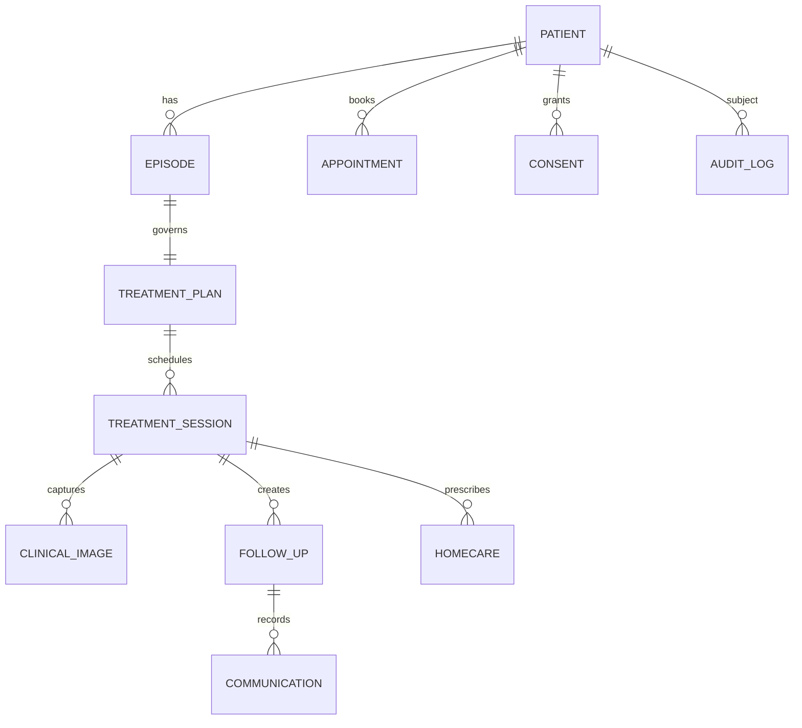

# Domain model cho liệu trình dọc

## Relationship diagram



## Core entities
- **Patient / PatientProfile**: identity, contact, consent preferences; tách PII khỏi clinical projection.
- **EpisodeOfCare**: concern/condition, start/end, status, owner; gom một liệu trình.
- **Assessment / Diagnosis / Concern**: clinical reasoning và confidence/source, không gán diagnosis từ AI placeholder.
- **TreatmentPlan / TreatmentPlanItem**: goal, protocol, planned sessions, cadence, expected evidence.
- **TreatmentSession / Procedure / DeviceSettings**: performed date, operator, actual parameters, tolerance, outcome, note.
- **ClinicalImage / ImageSet / BodyArea**: object storage key, capture protocol, view, region, lighting/device, consent, linked event.
- **Medication / Prescription / HomeCareInstruction**: instruction, start/end, acknowledgement, safety text.
- **CatalogOrder / CatalogOrderLine**: product code + source row/hash, frozen name/unit/price, quantity, usage/note, catalogRoute/route/override reason. Draft → approved với reviewer/time/version, liên kết invoice. PRESCRIPTION và CONSULTATION là hai projection của cùng order; NONE vẫn được tính tiền, UNRESOLVED chặn phát hành.
- **FollowUp / PatientReportedOutcome / Communication / Task**: due date, channel, severity, owner, state, response.
- **Appointment / Visit / Consent / Document**: operational and legal records; appointment != visit.
- **Invoice / Payment / Package**: light billing context linked to service/session, not an accounting ledger.
- **Staff / Role / AuditLog**: least privilege, actor, timestamp, before/after.

## Key design decision
Use an append-only clinical event envelope:

```json
{"id":"evt_...","patientId":"p_...","episodeId":"ep_...","type":"treatment.session.completed","occurredAt":"2026-09-20T09:30:00+07:00","actorId":"staff_...","source":"clinic","payload":{"sessionId":"sess_..."},"visibility":"care-team"}
```

Read models produce Patient 360, Follow-up Inbox and patient app. This allows AI to cite source event IDs and prevents a summary from becoming the source of truth. Mutations require audit entry; images require consent and retention policy.

## Session contract
`planned → arrived → in_progress → completed | cancelled`; completed requires procedure note, operator, aftercare sent/declined, next step, and required image set. Exception states (reaction, no-show, missing-photo) remain visible tasks.

## Reusable/configurable/Pema-specific
Reusable: patient/episode/timeline, appointments, plans/sessions, images, follow-up, portal, RBAC/audit. Configurable: protocol templates, forms, consent, image views, SLA, notifications, branding, service catalog. Pema-specific: pilot naming, staff roles, local Zalo/call scripts, exact laser protocols and package rules.


## Bổ sung Flutter template — 22/09/2026

Model nghiệp vụ trong tài liệu này là định hướng hệ thống/web, không phải toàn bộ shape của Flutter. Native hiện có order snapshot và receipt total theo patient; lịch/buổi/note/follow-up còn chung phiên, chưa có invoice/payment ledger, session record hoặc durable consent. Xem bảng runtime trong [ARCH-PB01](ARCH-PB01.md) và [parity](22_NATIVE_PARITY_AND_VALIDATION.md) trước khi mở rộng model.
